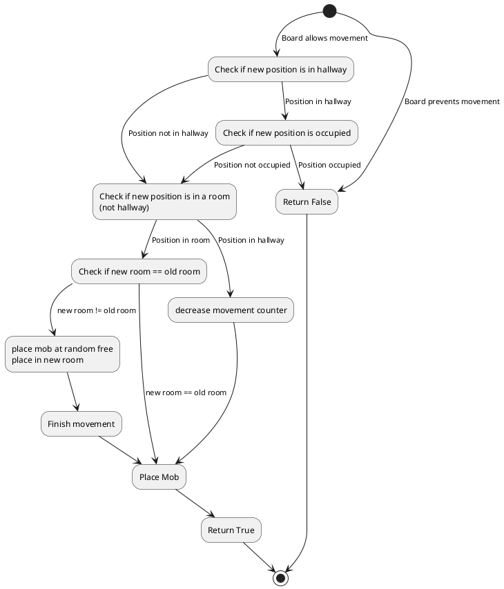

```puml
@startuml
(*) --> [Board allows movement] "Check if new position is in hallway"
"Check if new position is in hallway" --> [Position in hallway] "Check if new position is occupied"
"Check if new position is occupied" --> [Position not occupied] "Check if new position is in a room\n(not hallway)"

"Check if new position is occupied" --> [Position occupied] "Return False"

"Check if new position is in hallway" --> [Position not in hallway] "Check if new position is in a room\n(not hallway)"

"Check if new position is in a room\n(not hallway)" --> [Position in hallway] "decrease movement counter"
"decrease movement counter" --> "Place Mob"
"Check if new position is in a room\n(not hallway)" --> [Position in room] "Check if new room == old room"
"Check if new room == old room" --> [new room == old room] "Place Mob"
"Check if new room == old room" --> [new room != old room] "place mob at random free\nplace in new room"
"Finish movement" --> "Place Mob"
"place mob at random free\nplace in new room" --> "Finish movement"


(*) --> [Board prevents movement] "Return False"
"Return False" --> (*)
"Return True" --> (*)

"Place Mob" --> "Return True"

@enduml
```
